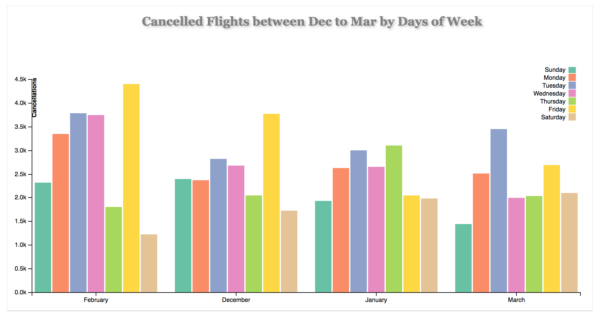

## Data Visualisation with D3: Total US Flights Cancellations 2008 ##

### Summary ###

There are three visualisations used in this project. All three of them display cancelled flights in the US in year 2008. I started the presentation with a line chart, following it up with an ordered bar chart and finally finishing with a grouped chart. Both the line chart and the bar chart show total annual cancellations broken down into months. The grouped bar chart shows the number of cancellations broken down into months and then further separated by days of week.

### Design ###

I used US flights data from 2008 downloaded from <a href="http://stat-computing.org/dataexpo/2009/the-data.html">this page</a> and is provided by <a href="https://www.transtats.bts.gov/OT_Delay/OT_DelayCause1.asp">RITA</a>. When I started working on the project I focused on designing only one chart which was a grouped chart showing number of cancellations separated by months and days of week. However, after the project was reviewed, I changed my approach and decide to introduce two more chart in order to show the trends more clearly. Why I did this is further explained in the Feedback section of the report. Below is the image of an initial sketch of the grouped chart I made using ggplot in R: 

#### Initial Sketch in ggplot: ####

For more information regarding this plot and data re-modelling process kindly click <a href="https://gautamjo.github.io/blogdown/2017/12/12/us-flight-cancellations-in-2008/">here</a>. 

The plot made in ggplot was then replicated in d3. Here is the image of the same:

#### Initial Sketch in d3: ####

If you wish to view the actual plot clicking [THIS](https://bl.ocks.org/gautamjo/raw/42f15332a5402ade4b314504edd31fb5/3efae9c49f774f414a5ecee4b211514e20dd9025/) link will take you there. Furthermore, there is a folder named trials in the repository in contains codes to all previous versions of this chart. If you wish to see those codes and view previous versions of the plot I request you to kindly access that folder.

Let me now briefly discuss about the design choices I made for this project. Because I was using conventional plots like line chart or bar plots which require use of primitive shapes, my objective was to keep the designs simple, minimal and neat. I used minimal backgrounds, basic axes and solid colour schemes for the plots in order to keep the plots easy on the eyes while maintaining a professional look. I tried keeping the plots engaging and interesting by introducing animations and interactivity in an effort to convey more information to the viewer. To explain this better, here are images of the three plots I have used in this project. 

#### Line Chart: Showing total number cancellations by months ####

Through this line chart we can observe rising and falling trends of cancellations throughout the year from January to December. We can see higher cancellations during the months of Jan, Feb, Mar and Dec. In the month of February we can observe highest number of cancellations with the total running above 20000 mark.

#### Ordered Bar Chart: Showing total number cancellation in descending order ####

The bar chart represents total number of cancelled flights in the US in 2008. It is separated by months and is designed to show the count of cancelled flights in descending order. We can observe highest number of cancellations in the month of February with more than 20000 cancellations. Months of December, January and March are next in line with cancellation reaching above 16000 in each of these months.

#### Grouped Chart: Showing total number of cancellations from Dec-Mar separated by day of week ####

In this plot, the four months (from Feb - Mar as they appear in the ordered chart)  with high cancellations are further separated by days of week. This is to show the viewer number of cancellations according to day of week.

### Feedback ###

I took two feedbacks from 2 different people. The third feedback was the review by the project reviewer. Here are there responses:

#### Interviewer #1 ####
>Your plot is animated but it does not have interactivity. Consider adding a tooltip to display day and count of cancellations so that it bring more clarity for the viewer.

#### Interviewer #2 ####
>Your plot is looking fine but if you add an animated title it might look better as a composition where all elements of the plot, be it shapes or text, are animated.

#### Interviewer #3 ####
> Currently, the visualisation is more exploratory than explanatory. To complete this section please help bring out a finding to the user. Examples could include trends or periodicity by month or day of the week. This may be helped by a design change such as line charts. The bar chart could still work though. Also consider a more divergent colour scheme (it's hard to see colours by day of the week) and using a narrative paragraph to help the reader focus on the main finding(s).

### Post Feedback ###

The changes I made to the chart post feedback are as follows:

* I added a tooltip displaying the name of day and total Number of cancelled flights on that day. I further added highlighting on the bars upon mouseover. 

* I added and styled an animated title in CSS which fades in and settles on top of the plot.  

* I added a line chart showing cancellation trends by month.

* I added an ordered bar chart showing cancellation count in descending order

* Reworked on the grouped chart limiting it to only four month from December to March where cancellation were higher than other months. Also, changed colour scheme from sequential to qualitative for better viewing of days week. 

Here are the links to the final rendition of plots:

* [Line Chart](https://bl.ocks.org/gautamjo/88930e3886feab371ceca8fcda3ae8cd/ca6b85af0b208489a8a678e8986bcc0e05447fcf)

* [Ordered Bar Chart](https://bl.ocks.org/gautamjo/bff786c997b6ab4a8c609951aac9f3aa/1f4177ab387379fe5305fae532bbd7ae43ffb9e1)

* [Grouped Bar Chart](https://bl.ocks.org/gautamjo/116c0af4b438b99ab444d971c661588b/414bce2d939526721c7df54a488e1c2c53f9717f)

The best way to view these plots, in my humble opinion, would be to use the internal link provided in the description of the plots. These links will take the viewer from one plot to the next in the correct order. 

### Resources ###

* https://d3js.org/

* <a href="https://bl.ocks.org/mbostock">Mike Bostock's Block - bl.ocks.org</a>

* Interactive Data Visualisation in D3 for the web by Scott Muray

* D3.js in action by Elijah Meeks

* Javascript Novice to Ninja by Darren Jones

### Data ###

* <code>total_cancellations_2008.csv</code> Remodelled data used for D3 visualisation.

      

